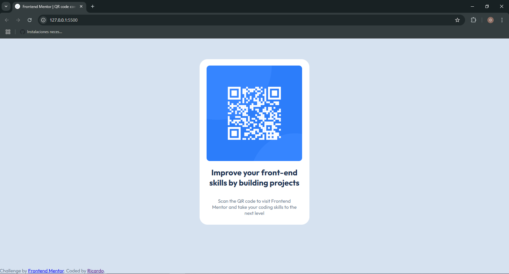

# Frontend Mentor - QR code component solution

This is a solution to the [QR code component challenge on Frontend Mentor](https://www.frontendmentor.io/challenges/qr-code-component-iux_sIO_H). Frontend Mentor challenges help you improve your coding skills by building realistic projects. 

## Table of contents

- [Overview](#overview)
  - [Screenshot](#screenshot)
  - [Links](#links)
- [My process](#my-process)
  - [Built with](#built-with)
  - [What I learned](#what-i-learned)
  - [Continued development](#continued-development)
- [Author](#author)

## Overview

### Screenshot



### Links

- Solution URL: [Solution](https://github.com/rc-0105/QR_code_component)
- Live Site URL: [Pages](https://rc-0105.github.io/QR_code_component/)

## My process

### Built with

- Semantic HTML5 markup
- CSS 
- Flexbox

### What I learned

Okay, i began with the html, i tried to do it the more semantical way posible and i leave the div about atribution of the project.

```html
  <main>
    
    <h1>Improve your front-end skills by building projects</h1>
    <p>Scan the QR code to visit Frontend Mentor and take your coding skills to the next level</p>
  </main>
```
If there is a better way to do it, ill be gratefull to hear.
```css
p{
    padding-left: 35px;
    padding-right: 35px;
}
```
And here i did the padding this way cause i didnt want that much space between this two components, again if you have suggestions ill hear them nicely. Also i didnt do it responsive.


### Continued development

I didnt feel confortable doing centering of the components, ill try to improve on how i write the css to make sure i wont go back on previous codes to make litle changes that may not change the result of the product.


## Author

- Website - [Ricardo](https://github.com/rc-0105)
- Frontend Mentor - [@rc-0105](https://www.frontendmentor.io/profile/rc-0105)


